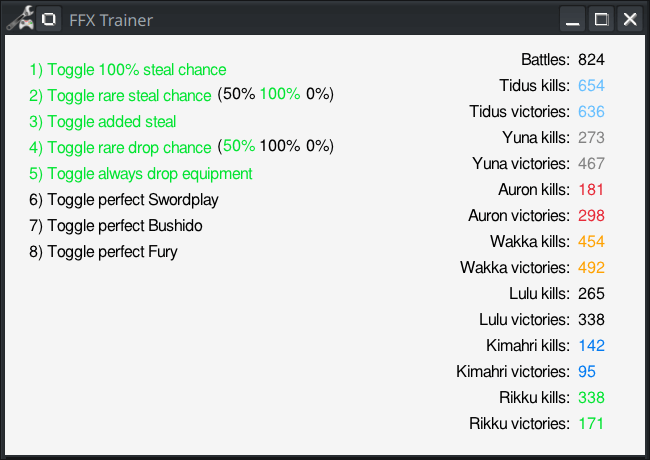

Final Fantasy X Trainer
===

## Building

This project uses Make to compile in to the `build` directory.

```shell
git clone git@github.com:PhilipArmstead/FFX-Trainer.git ffx-trainer
cd ffx-trainer
make
cd build
./ffx-trainer
```

## About this tool

This application enables certain cheats for the Steam version of
Final [Fantasy X/X-2 HD Remaster](https://store.steampowered.com/app/359870/FINAL_FANTASY_XX2_HD_Remaster/).

### Features

This tool allows for the following cheats:

- Steal with 100% reliability
- Fix rare steal chance:
	- 0% (for always common steals)
	- 100% (for always rare steals)
	- 50%
- Steal with every action taken against an enemy
- Fix rare drop chance:
	- 0% (for always common drops)
	- 100% (for always rare drops)
	- 50%
- Always drop equipment
- Auto-succeed Swordplay Overdrive
- Auto-succeed Bushido Overdrive
- Begin Fury Overdrive at a count of 12

Additionally, statistics for battles, kills and victories are shown.


